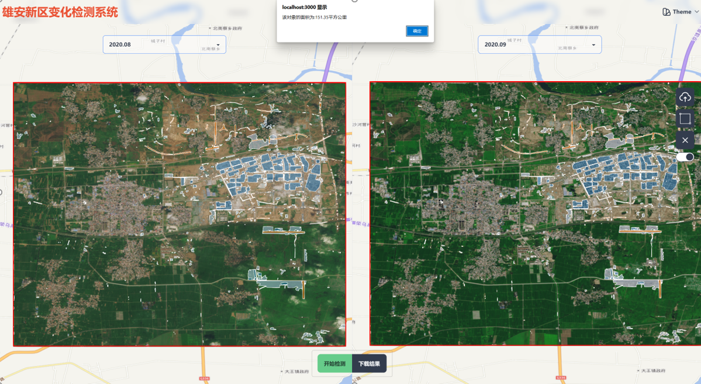
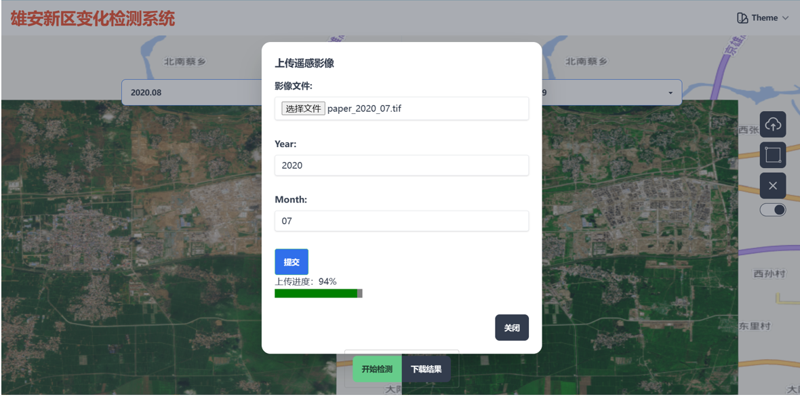

<div align='center'>
<h1>变化检测系统界面 </h1>
</div>




## 特性

- ⚡  [Vue 3](https://github.com/vuejs/vue-next), [Vite 2](https://github.com/vitejs/vite), [pnpm](https://pnpm.js.org/) - 为速度而生
- 💪 [Typescript](https://www.typescriptlang.org/) - 强大的类型检查
- 🔥 使用 [新的 `<script setup>` 语法](https://github.com/vuejs/rfcs/pull/227)
- 💡 [Vue Router v4](https://router.vuejs.org/zh/) - Vue 路由系统
- 🎨 [Tailwind CSS v3](https://tailwindcss.com/docs/configuration) - 快速建立现代网站，而不必离开 HTML。
- 🎉 [NProgress](https://github.com/rstacruz/nprogress) - 页面加载进度反馈
- 🍍 [使用 Pinia 的状态管理](https://pinia.esm.dev/)
- 🌼 [Daisy](https://daisyui.com/) - 开源的 Tailwind CSS 组件库
- Mars3d - 国人对Cesium框架的二次开发库

### 集成 Tailwind 插件:

- [tailwindcss/forms](https://github.com/tailwindlabs/tailwindcss-forms)
- [tailwindcss/typography](https://tailwindcss.com/docs/typography-plugin)
- [tailwindcss/line-clamp](https://github.com/tailwindlabs/tailwindcss-line-clamp)
- [tailwindcss/aspect-ratio](https://github.com/tailwindlabs/tailwindcss-aspect-ratio)

## 运行命令

### 首次运行前安装依赖

```
npm i  /pnpm
```


### 启动开发环境

```
npm run dev /pnpm
```

### 打包构建

```
npm run build /pnpm
```


## Mars3D 是什么

> `Mars3D平台` 是[火星科技](http://marsgis.cn/)研发的一款基于 WebGL 技术实现的三维客户端开发平台，基于[Cesium](https://cesium.com/cesiumjs/)优化提升与 B/S 架构设计，支持多行业扩展的轻量级高效能 GIS 开发平台，能够免安装、无插件地在浏览器中高效运行，并可快速接入与使用多种 GIS 数据和三维模型，呈现三维空间的可视化，完成平台在不同行业的灵活应用。

> Mars3D 平台可用于构建无插件、跨操作系统、 跨浏览器的三维 GIS 应用程序。平台使用 WebGL 来进行硬件加速图形化，跨平台、跨浏览器来实现真正的动态大数据三维可视化。通过 Mars3D 产品可快速实现浏览器和移动端上美观、流畅的三维地图呈现与空间分析。

### 相关网站

- Mars3D 官网：[http://mars3d.cn](http://mars3d.cn)

- Mars3D 开源项目列表：[https://github.com/marsgis/mars3d](https://github.com/marsgis/mars3d)

## 版权说明

1. Mars3D 平台由[火星科技](http://marsgis.cn/)自主研发，拥有所有权利。
2. 任何个人或组织可以在遵守相关要求下可以免费无限制使用。
